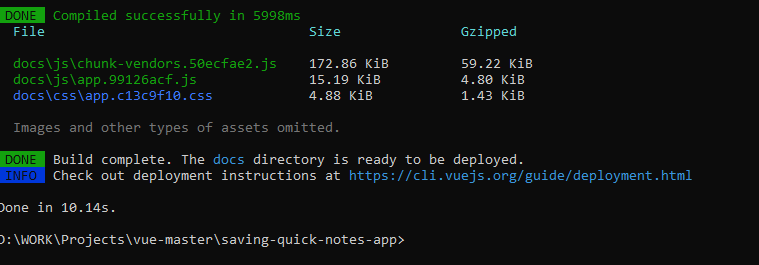

# Saving Quick Notes - Vue

## Project setup
```
yarn install
```

### Compiles and hot-reloads for development
```
yarn run serve
```

### Compiles and minifies for production
```
yarn run build
```
### Screenshots of the application





